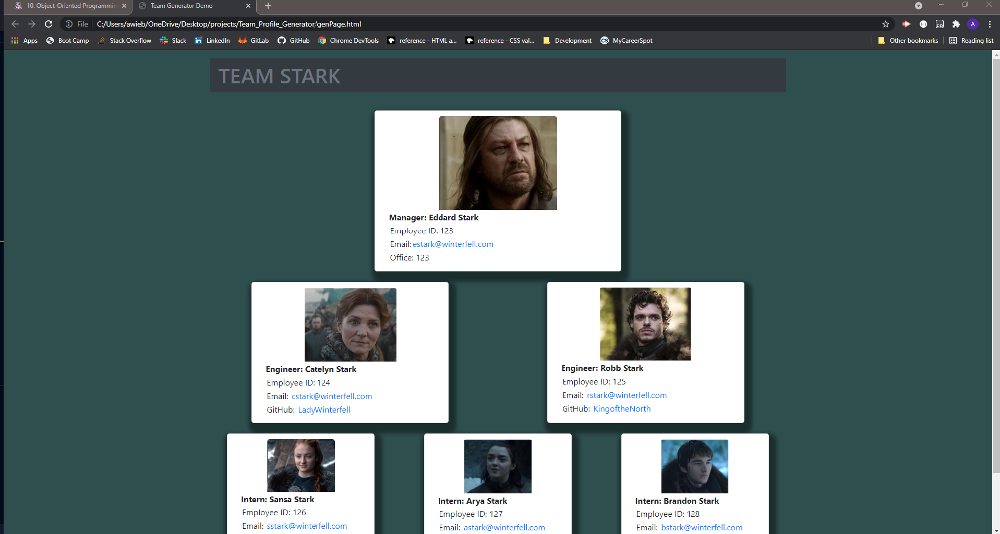

# Team Profile Generator 

## Description 

**Object-Oriented Programming Challenge: Team Profile Generator**

**Challenge Elements**
The challenge is to build a Node.js command-line application that takes in information about 
employees on a software engineering team and generates an HTML webpage that displays summaries 
for each person. Because testing is key to making code maintainable, you’ll also write unit 
tests for each part of your code and ensure that it passes all of them.

## Installation

Because this application won’t be deployed, you’ll also need to provide a link to a walkthrough 
video that demonstrates its functionality and all of the tests passing. You’ll need to submit a 
link to the video and add it to the README of your project.

-The link to the video: https://github.com/AWiebe2021/Team_Profile_Generator
-The projects code can be accessed at: https://github.com/AWiebe2021/Team_Profile_Generator

## Screenshot

## Credits
Solo project
